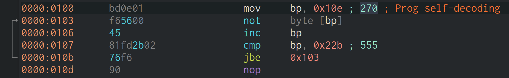
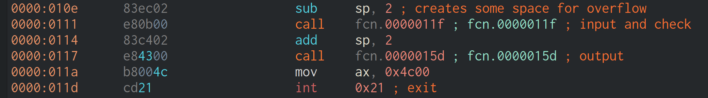
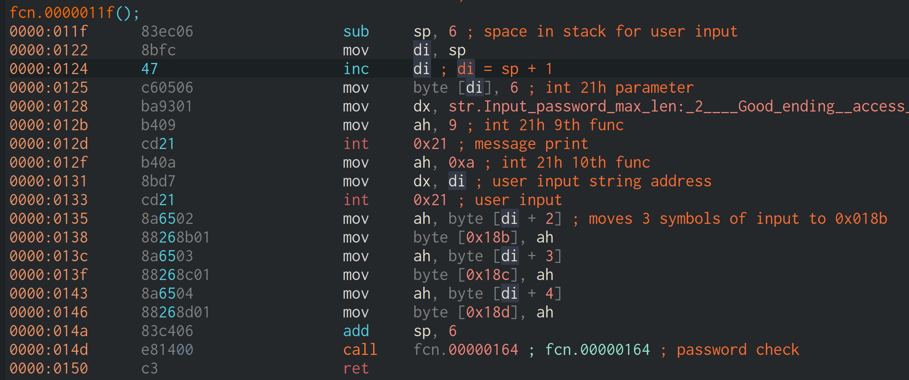
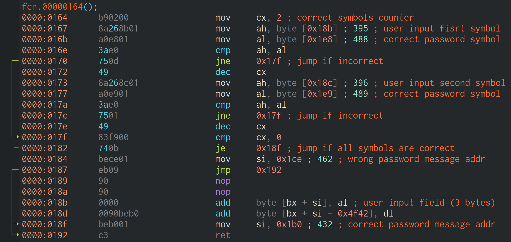
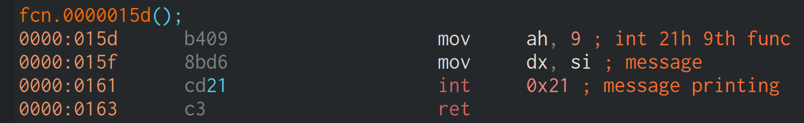
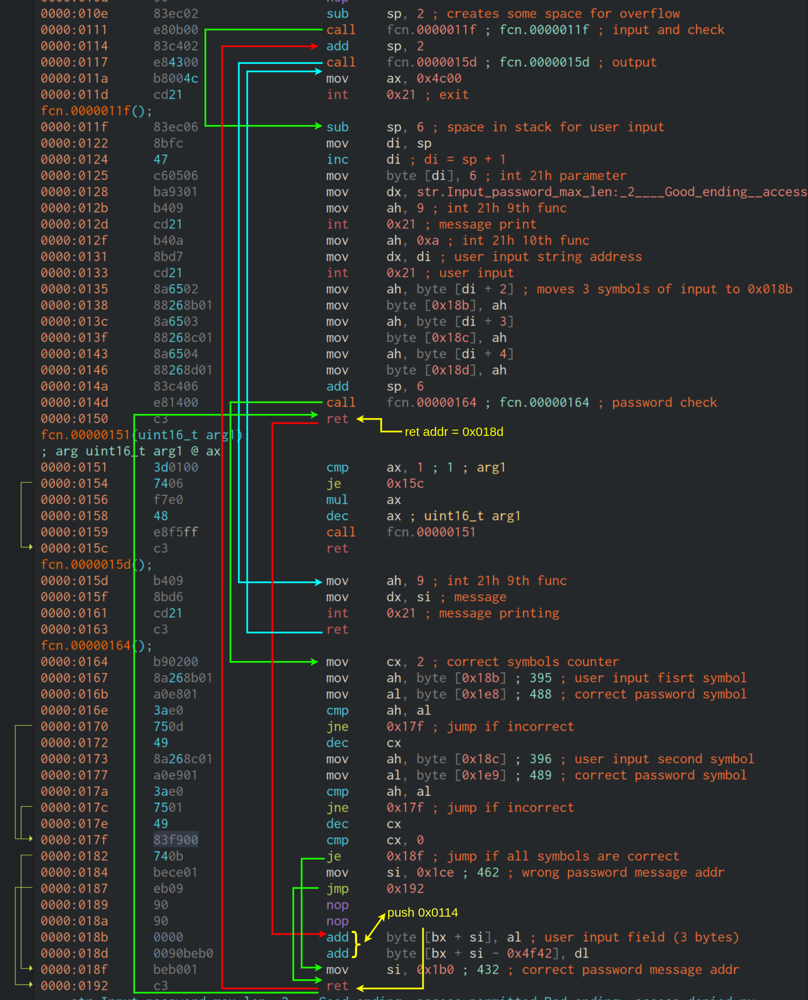

# Взаимный взлом ассемблерных программ

## Моя программа

// TODO

## Взлом программы fogInSingularity

### Штатная работа программы

#### Декодирование исходного кода (`0x0100` - `0x010e`)

В начале программа сама себя дешифрует путём применения побитого НЕ.



Для дизассемблирования был написан скрипт на C, который декодировал исходный файл и заполнил код-декодер командами `nop`.

#### Главная функция программы (`0x010e` - `0x011e`)

Вызывает 2 функции:
- функция ввода и проверки пароля
- функция печати результата

Перед вызовами сдвигает `sp` на 2 байта влево. Это требуется для уязвимости переполнения (см. ниже).

Команды



#### Функция ввода (`0x011f` - `0x0151`)

Функция печатает приветсвие, запрашивает ввод от пользователя (максимум `6 - 1 = 5` байт). Затем 3 байта пользовтельского ввода копируются в область `0x018b` - `0x018e`. На самом деле программа проверяет только 2 символа пароля, но передача трёх байт сделана для уязвимости переполнения. Затем вызывается функция проверки пароля.



#### Функция проверки пароля (`0x0164` - `0x0193`)

Функция заводит счётчик в регистре `cx`. Изначально он равен 2. Счётчик уменьшается при каждом совпадении символа. Если счётчик в конце равен 0, в `si` записывается адрес строки с сообщением о вводе верного пароля, иначе наоборот.

Функцией ввода пароля в область `0x018b` - `0x018e` записываются 3 введённых пользователем байта.



#### Функция печати результата (`0x015d` - `0x0164`)

Функция выводит сообщение, адрес которого ранее был записан в `si`.



### Уязвимость переполнения входного буфера

При вводе следующих байт программа выдаёт сообщение о верном пароле:

```
68 14 01 8b 01 0d
\------/ \---/ CR
    |      |
    | ret address 0x018b
    |
push 0x0114
```

Разберём последовательность событий при исполнении программы с данным вводом.

Введённые данные попадают в стек. 3 первых байта ввода помещаются в память начиная с адреса `0x018b`.

Для данных в стеке выделено 3 байта. После них находится адрес возврата из функции ввода пароля. В результате переполнения он заменяется адресом `0x018b`. А туда мы только что поместили первые 3 байта ввода (команду `push 0x0114`). Она поместит в стек адрес, который впоследствии будет интерпретирован как адрес возврата.

`CR` (символ возврата каретки) нужен для правильной работы функции ввода DOS. Он не мешает работе программы при переполнении, так как до вызова функции ввода в главной функции `sp` был сдвинут на 2 байта влево.

После считывания данных функция ввода пароля стандартно вызовет функцию проверки, которая поместит в `di` адрес сообщения о вводе неверного пароля. Произойдёт стандартный возврат в функцию ввода. С этого момента начинается нестандартное поведение программы. `ret` функции ввода считает из стека подменённый ранее адрес `0x018b`. Произойдёт прыжок по этому адресу. Эта область так же подменена. В ней теперь находится команда `push 0x0114`. Адрес `0x0114` разместится на стеке. Затем выполнится команда `mov si, 0x01b0` и в `si` запишется адрес сообщения о вводе верного пароля. После произойдёт возврат по адресу на верхушке стека, который мы ранее записали (`0x0114`). Программа вернётся в главную функцию, произойдёт стандартный вызов процедуры вывода сообщения и выход из программы.

Зелёные стрелки - стандартный порядок выполнения до вмешательства в работу программы; красные стрелки - действия, вызванные переполнением; голубые стрелки - стандартные действия после вмешательства. Жёлтым цветом выделены изменения, внесённые переполнением.


